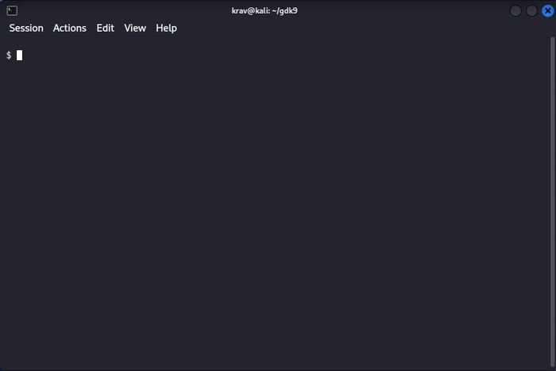

# **GDk9: A Universal Symbolic Grammar**

## Preamble

Welcome to the **GDk9 Handbook**—the reference guide for reading, writing, and reasoning with the GDk9 Alphabet. GDk9 is a universal symbolic system designed to unify physics, cognition, language, and computation under a single implicational grammar. This alphabet is not a decorative script; it is a structured energetic substrate derived from the **GDk9 Implication Engine**, originally defined in the foundational whitepaper by @beathovn.

GDk9 reinterprets the Roman alphabet (A–Z, a–z) as **energetic operators**. Each symbol holds a quantifiable “rest-energy” signature, reflecting its topological shape, symmetry class, and cognitive function. Letters act as conserved states within a universal transformational process—where informational energy behaves analogously to mass-energy (E = mc²) and Shannon entropy.

The handbook is layered for readers at different depths. Early chapters teach practical reading and writing. Later chapters expand into vectorization, topology, homotopy, and category theory—tools that make GDk9 computationally rigorous and suitable for cryptography, AI reasoning, system design, and decentralized economies.

**Executive Summary**
GDk9 forms a **Universal Symbolic Architecture (USA)** built on conserved rest-energy. Symbols function as energetic differentials (I = k log Ω), enabling a unified model across:

* Physics ↔ Computation
* Language ↔ Logic
* Identity ↔ Access
* Games ↔ Economics

Every GDk9 word is a conserved transformation—a symbolic circuit that remains faithful to energetic invariants. This handbook equips you to generate, analyze, and validate these circuits.

---

## CLI — output examples



**`gdk9 --color dcg classify FWEM`** — symmetry class, SymPhi energy, and 4D vector for each letter:


**`gdk9 --color profile "The quick brown fox jumps over the lazy dog"`** — digital-root energy histogram with coloured block bars:


Install and try it:
```bash
pip install -e .
gdk9 --color dcg classify FWEM
gdk9 --color profile "your text here"
```

---

## Table of Contents

1. [Foundations: Alphabet & Symmetry Types](#foundations)
2. [Reading GDk9: Decoding Symbols and Words](#reading)
3. [Writing GDk9: Composing Expressions](#writing)
4. [Understanding GDk9: Cognitive & Energetic Models](#understanding)
5. [Advanced Methods: Vectorization, Topology, Homotopy](#advanced)
6. [Category Theory Integration](#category)
7. [Applications: Cryptography, AI & Systems](#applications)
8. [Glossary](#glossary)
9. [Exercises & References](#exercises)

---

## 1. Foundations: Alphabet & Symmetry Types <a name="foundations"></a>

GDk9 extends the standard 52-letter Roman alphabet into a symmetry-based cognitive framework. **Uppercase** letters represent *DC forms*—rigid, stable archetypes. **Lowercase** letters represent *AC forms*—dynamic variants that break symmetry to enable evolution.

**Executive View**
Each symbol is classified topologically: idempotent (self-stabilizing), biphasic (oscillatory), involutive (self-inverting), or asymmetric (directional). These align with energy invariants:
ΣE(before) = ΣE(after).

### Symmetry Types

| Symmetry Type  | Uppercase                       | Lowercase                 | Cognitive Class | Base Equation | Energetic Role                          |
| -------------- | ------------------------------- | ------------------------- | --------------- | ------------- | --------------------------------------- |
| **Idempotent** | A, H, I, M, O, T, U, V, W, X, Y | a, m, o, t, u, v, w, x, y | Stabilizer      | x² = x        | Self-similarity; preserves identity     |
| **Biphasic**   | B, C, D, E, K                   | b, c, d, e, k             | Oscillator      | x² = f(x)     | Dual-phase modulation (e.g. sinusoidal) |
| **Involutive** | N, S, Z                         | n, s, z                   | Flipper         | x² = 1        | Reversible inversion                    |
| **Asymmetric** | F, G, J, L, P, Q, R             | f, g, j, l, p, q, r       | Driver          | x² ≠ x,1      | Directional flow; change actuator       |

Unclassified marks (punctuation and extensions) act as **meta-operators**, enabling instructions, negation, or compositional modifiers.

---

## 2. Reading GDk9: Decoding Symbols and Words <a name="reading"></a>

Reading GDk9 uses **implicational flow**: a left-to-right traversal where each letter behaves as a morphism contributing to the total information-energy. Words become **paths** in the Directed Cognition Graph (DCG).

A word is valid if its energy is conserved under transformation.

### Reading Process

1. **Classify each letter** by symmetry type.
2. **Assign valuation** using:

   * pos(letter) = alphabetical index
   * type_factor = {idempotent=1, biphasic=sin(pos), involutive=1/pos, asymmetric=pos+1}
   * E(s) = pos × type_factor
3. **Sum the energies** across the word: E(word) = Σ E(si)
4. **Interpret the path** on the DCG: each adjacency implies a morphism.
5. **Validate conservation** after any rewrite or transformation.

### Example

Word: **FWEM**

* F: asymmetric → E(F)=7
* W: idempotent → E(W)=23
* E: biphasic → E(E)=sin(5)≈−0.958
* M: idempotent → E(M)=13

Total: **≈42.04** → stable, conserved.

Interpretation: directional drive → wholeness → oscillation → mirrored integration.

**Executive View**
Reading is evaluation of the Implication Engine: I: Eⁿ → Eᵐ. Landauer’s principle applies—irreversible readings imply energetic cost.

---

## 3. Writing GDk9: Composing Expressions <a name="writing"></a>

Writing is the reverse of reading: build a conserved energy pathway from a chosen archetype.

### Writing Workflow

1. **Choose an archetype** (idempotent is typical).
2. **Apply morphisms** using DCG adjacency.
3. **Introduce modulation** via biphasic letters.
4. **Resolve** using an involutive or asymmetric terminal.
5. **Validate** via E(input) = E(output).

### Examples

* Expression for “conserved transformation”:
  **MF(e)N**
  Mirrors → drives → oscillates → flips.
  Energy remains in the 42-range.

* Word filters:

  * Valid if contains at least one DC→AC junction.
  * Invalid if fully involutive (e.g., “ZZ”) unless context demands full reversal.

---

## 4. Understanding GDk9: Cognitive & Energetic Models <a name="understanding"></a>

GDk9 is built on the principle that symbolic cognition mirrors physical processes. Letters are treated as energetic states; words become structured flows.

### Cognitive Layers (USA Model)

1. **Physics ↔ Computation** — symbols as quantum-like states.
2. **Language ↔ Logic** — words as propositions with conserved transformations.
3. **Identity ↔ Access** — DC (rigid identity) → AC (fluid permissions).
4. **Games ↔ Economics** — words as energetic assets.

Example:
**AVWM** represents a pathway from singularity → inversion → duplication → integration.

---

## 5. Advanced Methods: Vectorization, Topology, Homotopy <a name="advanced"></a>

The GDk9 Alphabet becomes computationally powerful when expressed through continuous mathematics.

---

### Vectorization

Each symbol becomes a **4-dimensional vector**:

[
v_s = [pos,\ type_id,\ \sqrt{E(s)},\ \sin(\theta_s)]
]

Words are vector sums or concatenated embeddings.

This enables ML models, symbolic regression, and GDk9-native embeddings.

---

### Topology: The DCG

The Directed Cognition Graph is a compact, Hausdorff topological space where:

* nodes = symbols
* edges = allowable morphisms
* open sets = symmetry clusters

This supports shortest-path analysis, equivalence classes, and deformation studies.

---

### Homotopy

Two words are homotopy-equivalent if one can be continuously deformed into the other without energy spikes.

Formally:

[
H(s,t) = (1-t)p_0(s) + t p_1(s)
]

Example: **FWeM** → **FeWM** is valid; energy conserved.

---

## 6. Category Theory Integration <a name="category"></a>

GDk9 forms a category **𝒢𝒹𝓀₉**:

* **Objects**: letters
* **Morphisms**: energy-preserving implications
* **Identities**: id_s
* **Inverses**: involutive N, S, Z
* **Functors**: map GDk9 structures into physics, logic, economic systems
* **Natural transformations**: DC → AC mappings

This formalizes GDk9 as a programmable symbolic substrate.

---

## 7. Applications: Cryptography, AI, Systems <a name="applications"></a>

GDk9 is directly suitable for:

* **Symbolic Cryptography** — keys as invariant paths; Z-flips for reversible transforms.
* **AI Reasoning** — vectorized homotopy datasets for stable inference.
* **Economics & Games** — words as energetic tokens traded on DCG graphs.
* **Knowledge Graphs** — USA layers mapped as commutative functors.

---

## 8. Glossary <a name="glossary"></a>

* **Conservation Axiom** — ΣE(si) = ΣE(s'j).
* **DCG** — Directed Cognition Graph.
* **Homotopy** — continuous symbolic deformation.
* **Implication Engine** — transformation kernel I: Eⁿ → Eᵐ.
* **Rest-Energy Substrate** — E = mc² applied symbolically.
* **USA** — Universal Symbolic Architecture.
* **Vectorization** — mapping symbols to ℝ⁴ for computation.

---

## 9. Exercises & References <a name="exercises"></a>

### Exercises

1. Decode **“BZ”** and write a homotopy-equivalent form.
2. Vectorize **AVWM** and compute the shortest DCG path.
3. Design a cryptographic key based on an F/e oscillation cycle.

### References

* *GDk9 Whitepaper* (@beathovn, 2025)
* Einstein (1905), Shannon (1948), Turing (1936)
* Code modules: `gdk9-framework.py`, `gdk9-core-engine.py`

---

Master GDk9—and help extend this universal grammar into the open framework.

