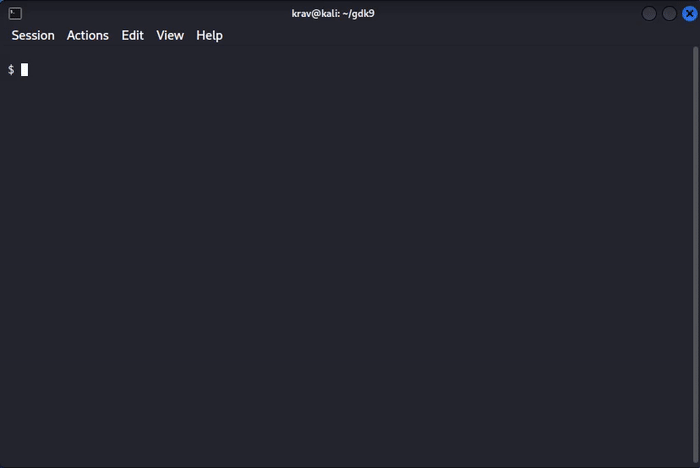

# GDk9

**Symbolic energy toolkit: a zero-dependency Python CLI, the KeySuite reference runtime, and a web console for the GDk9 implication grammar.**

[](https://github.com/ao3575911/gdk9/actions/workflows/ci.yml)
[](LICENSE)




GDk9 treats letters as energetic operators. The `gdk9` CLI analyzes, profiles,
transforms and encrypts text with the GDk9 implication engine; **KeySuite** is the
deterministic reference runtime for the GDk9 grammar, with conformance vectors; the
**KeySuite console** is a local React UI over the same algebra.

## Install

Requires Python 3.9+. The core CLI has no runtime dependencies.

```bash
git clone https://github.com/ao3575911/gdk9.git
cd gdk9
python -m venv .venv && . .venv/bin/activate
pip install -e .
```

Optional extras: `pip install -e ".[secure]"` (AES-GCM via `cryptography`),
`".[dev]"` (pytest, ruff, build), `".[egglog]"` (egglog bridge, Python 3.11+).

## Quickstart

```bash
gdk9 --version
gdk9 analyze "Hello, world!"
gdk9 profile "The quick brown fox jumps over the lazy dog"
gdk9 dcg classify FWEM
gdk9 kernel eval "FWEM"
python examples/01_analyze.py
python -m gdk9.rewrite.cli run tests/rewrite/rulesets/ruleset1.txt "A B C"
```

KeySuite runtime (Python 3.10+):

```bash
cd packages/keysuite-runtime
pip install -r requirements.txt && pip install -e .
keysuite "C C . 3 3"
keysuite conformance conformance/vectors
```

KeySuite console (Node 22):

```bash
cd apps/keysuite-console
npm ci
npm test
npm run dev      # http://localhost:5173
```

More: [Quickstart](docs/QUICKSTART.md) · [CLI reference](docs/CLI.md) ·
[API](docs/API.md) · [Architecture](docs/ARCHITECTURE.md) ·
[Alphabet handbook](docs/ALPHABET.md) · [Examples](examples/)

## Repository layout

| Path | What it is | Stack | License |
| --- | --- | --- | --- |
| `gdk9/`, `tests/`, `examples/`, `docs/` | `gdk9-cli` package: CLI, kernel, DCG, crypto, plugins | Python 3.9+ | AGPL-3.0-or-later |
| `gdk9/rewrite/`, `tests/rewrite/` | Symbol Rewrite Reactor: rule-based symbol rewriting until canonical collapse or a cycle. See [`docs/REWRITE.md`](docs/REWRITE.md). Formerly `ao3575911/Symbol-Rewrite-Reactor` | Python 3.9+ | MIT |
| `packages/keysuite-runtime/` | KeySuite reference runtime, REST/WebSocket API, conformance vectors | Python 3.10+ | MIT |
| `apps/keysuite-console/` | KeySuite local web console | TypeScript, React, Vite | MIT |
| `legacy/gdk9-fork/` | Snapshot of the AGI-H4X/gdk9 fork (unmaintained) | Python | GPL-3.0 |
| `legacy/gdk9-alphabet/` | Early hollow-vector character embedding (unmaintained) | Python | MIT |
| `legacy/symphi-engine/` | Early SymPhi physics-aware engine (unmaintained) | Python | GPL-3.0 |
| `docs/keysuite-gist.md` | Original KeySuite gist README | Markdown | — |

Each subproject was merged with its full git history (`git log -- <path>`).
`legacy/` is kept for reference only and is excluded from lint and CI.

## Running tests

```bash
# gdk9 CLI
pip install -e ".[dev]"
python -m pytest -q
ruff check .

# KeySuite runtime
cd packages/keysuite-runtime && python -m pytest -q && keysuite conformance conformance/vectors

# KeySuite console
cd apps/keysuite-console && npm ci && npm test && npm run typecheck
```

CI runs all three on every push and pull request to `main`.

## License

The repository as a whole is licensed under the
[GNU Affero General Public License v3.0 or later](LICENSE).

**LICENSES:** subfolders keep their original licenses, each with its own `LICENSE` file:
`packages/keysuite-runtime/`, `apps/keysuite-console/` and `legacy/gdk9-alphabet/` are
MIT; `legacy/gdk9-fork/` and `legacy/symphi-engine/` are GPL-3.0.
